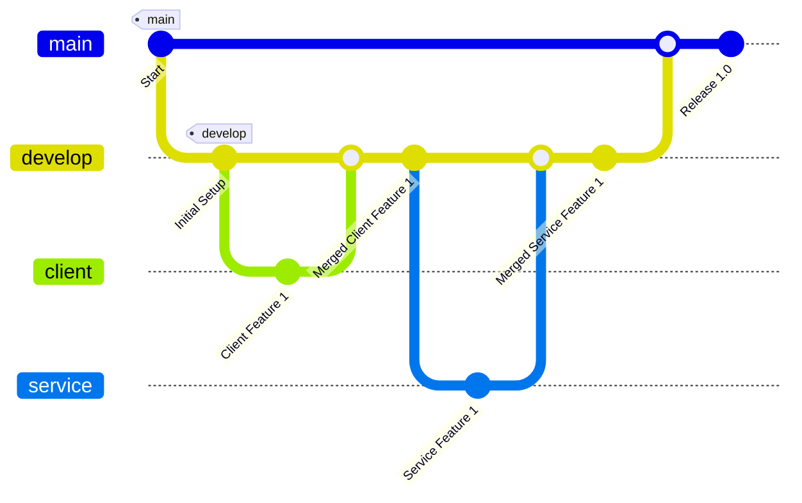

# Arquitetura do Projeto

Este documento descreve a arquitetura do projeto do aplicativo, incluindo a estrutura de pastas, o objetivo do projeto e o fluxo de trabalho Git adotado.

## Objetivo do Projeto

O objetivo deste projeto é desenvolver um aplicativo moderno e escalável que ofereça uma interface de usuário intuitiva e responsiva, além de um back-end robusto para lidar com a lógica de negócios e a gestão de dados.

## Estrutura de Pastas

O projeto do aplicativo é dividido em duas principais pastas: `client` e `service`.

- **📁 `client`**: Contém o código fonte da interface do usuário do aplicativo, desenvolvido com React (e possivelmente React Native para componentes específicos de dispositivos móveis). Esta pasta inclui todos os componentes visuais, estilos e a lógica de interação do front-end, adaptados para uma experiência móvel.
- **📁 `service`**: Contém o código fonte do back-end do aplicativo, desenvolvido em Spring Boot. Esta pasta inclui a lógica de negócios, APIs REST, e outras funcionalidades relacionadas ao servidor que suportam o aplicativo.
## Fluxo Git

O projeto do aplicativo segue um fluxo de trabalho Git estruturado para facilitar o desenvolvimento, teste e implantação contínuos. As principais branches e suas funções são descritas a seguir:

- **Branch `main`**: A branch principal que contém a versão estável do código do aplicativo. As versões de produção são derivadas desta branch.

- **Branch `develop`**: A branch de desenvolvimento que contém as funcionalidades em estágio de desenvolvimento e teste. Esta branch é usada para integração contínua e testes de qualidade.

- **Branches Filhas da Develop**:
  - **`client`**: Ramificada a partir de `develop`, esta branch é usada especificamente para desenvolvimento de funcionalidades e correções relacionadas à interface do usuário e à lógica do front-end do aplicativo.
  - **`service`**: Ramificada a partir de `develop`, esta branch é usada para desenvolvimento de funcionalidades e correções relacionadas ao back-end e à lógica de negócios do aplicativo.

### Diagrama de Fluxo Git



## Procedimentos de Desenvolvimento

1. **Novo Desenvolvimento**: Crie uma nova branch a partir de `develop` para trabalhar em uma nova funcionalidade ou correção de bug específica do aplicativo.
2. **Commits**: Faça commits regulares e descritivos para cada alteração significativa, documentando claramente o progresso e as alterações.
3. **Merge**: Após o desenvolvimento e testes na branch filha (`client` ou `service`), faça um merge de volta para `develop`.
4. **Revisão de Código**: Realize uma revisão de código antes de integrar as alterações na branch `develop` para garantir qualidade e consistência.
5. **Lançamento**: Quando estiver pronto para uma nova versão do aplicativo, faça um merge da branch `develop` para a branch `main`.

---

<details>

<summary>
    Regras de versionamento
</summary>
    Para definir regras de versionamento de código e permissões de merge no GitHub, você pode configurar as regras de proteção de branch e as políticas de revisão de código. Aqui está um guia passo a passo para configurar essas regras:

### 1. Configurando Regras de Proteção de Branch

1. **Acesse o Repositório no GitHub**:

   - Vá para o seu repositório no GitHub.

2. **Vá para as Configurações**:

   - Clique na aba "Settings" (Configurações).

3. **Branch Protection Rules**:

   - No menu lateral, clique em "Branches" (Branches).
   - Em "Branch protection rules" (Regras de proteção de branch), clique em "Add rule" (Adicionar regra).

4. **Definir Regras de Proteção**:

   - **Branch Name Pattern**: Defina o padrão de nome da branch, como `main`, `developer`, etc.
   - **Require Pull Request Reviews**:
     - Marque a opção "Require pull request reviews before merging" (Requerer revisões de pull request antes de fazer merge).
     - Defina o número de revisores necessários.
   - **Require Status Checks**:
     - Marque a opção "Require status checks to pass before merging" (Requerer verificações de status para passar antes do merge).
     - Adicione os checks de status necessários, como testes automatizados.
   - **Include Administrators**:
     - Marque "Include administrators" (Incluir administradores) se quiser que as regras também se apliquem aos administradores do repositório.
   - **Restrict Who Can Push to Matching Branches**:
     - Marque "Restrict who can push to matching branches" (Restringir quem pode fazer push para branches correspondentes).
     - Adicione os usuários ou equipes autorizados a fazer push diretamente.

5. **Salvar Regras**:
   - Clique em "Create" ou "Save changes" (Salvar alterações).

### 2. Configurando Políticas de Revisão de Código

1. **Criar uma Política de Revisão**:

   - Na seção de "Branch protection rules" (Regras de proteção de branch), defina que os pull requests precisam de aprovação antes de serem mesclados.
   - Especifique o número mínimo de revisores necessários.

2. **Configurar Revisores Padrão**:
   - Nas configurações do repositório, você pode definir revisores padrão para pull requests. Isso pode ser feito através de equipes ou usuários específicos.

### 3. Exemplo de Regras para Branches Específicas

- **Branch `main`**:

  - Nenhum push direto é permitido.
  - Todos os merges devem ser feitos através de pull requests.
  - Pelo menos 2 revisores devem aprovar o pull request.
  - Todos os status checks devem passar antes do merge.

- **Branch `developer`**:

  - Nenhum push direto é permitido.
  - Todos os merges devem ser feitos através de pull requests.
  - Pelo menos 1 revisor deve aprovar o pull request.
  - Todos os status checks devem passar antes do merge.

- **Branches `client`, `service`, `UX`, `Testes`, `PO`**:
  - Push direto pode ser permitido para membros da equipe específica.
  - Recomenda-se o uso de pull requests e revisões, especialmente para mudanças significativas.

Com essas configurações, você garante um fluxo de trabalho de versionamento de código robusto e controlado, minimizando riscos e melhorando a qualidade do código.

</details>


<details>
<summary>Comandos `git`*</summary>

# Comandos Git e Merge

> **Como inicializo o git no meu meu projeto local?**

- **`git init`**  
  Inicializa um novo repositório Git.

> **Como baixo um repositório remoto para minha máquina?**

- **`git clone <url-do-repositório>`**  
  Clona um repositório remoto para o seu ambiente local.

> **Como vejo as alterações que acabei de fazer no meu projeto?**

- **`git status`**  
  Exibe o status das alterações no repositório.

> **Preparando alterações para subir meu projeto para o repositório remoto**

- **`git add <arquivo-ou-pasta>`**  
  Adiciona arquivos ou mudanças específicas para a área de staging.

- **`git commit -m "mensagem"`**  
  Salva as mudanças no repositório com uma mensagem de commit.

- **`git push <remote> <branch>`**  
  Envia os commits para o repositório remoto.

> **Atualizar repositório local**

- **`git pull <remote> <branch>`**  
  Baixa e incorpora mudanças do repositório remoto na branch atual.

> **Visualizar as branch na sua máquina**

- **`git branch`**  
  Lista todas as branches locais.

> **Navegar pelas branch**

- **`git checkout <branch>`**  
  Muda para uma branch específica.

> **Criar branch**

- **`git checkout -b <nova-branch>`**  
  Cria uma nova branch e muda para ela.

## 2. Comandos de Merge

- **`git merge <branch>`**  
  Mescla a branch especificada na branch atual.

- **`git merge --no-ff <branch>`**  
  Faz o merge criando um commit de merge, mesmo que seja possível fazer um fast-forward.

- **`git merge --squash <branch>`**  
  Mescla as mudanças da branch especificada, mas combina todos os commits em um único commit.

- **`git merge --abort`**  
  Aborta o processo de merge e retorna o repositório ao estado antes do início do merge.

- **`git log --merges`**  
  Exibe uma lista de merges no histórico de commits.

## 3. Resolução de Conflitos

- **`git diff`**  
  Mostra as diferenças entre os arquivos.

- **`git diff --staged`**  
  Mostra as diferenças entre os arquivos preparados para o commit.

- **`git mergetool`**  
  Lança uma ferramenta gráfica para ajudar na resolução de conflitos de merge.

- **`git add <arquivo>`**  
  Marca um arquivo como resolvido após resolver um conflito.

- **`git commit`**  
  Completa o merge após a resolução de conflitos.

## 4. Comandos de Histórico e Revert

- **`git log`**  
  Exibe o histórico de commits.

- **`git log --oneline --graph --decorate --all`**  
  Exibe o histórico de commits em uma linha, com grafo e informações de branch.

- **`git reset --hard <commit>`**  
  Reseta o histórico para um commit específico, descartando mudanças locais.

- **`git revert <commit>`**  
  Reverte um commit específico, criando um novo commit que desfaz as mudanças.

## 5. Outros Comandos Úteis

- **`git stash`**  
  Armazena temporariamente as mudanças não commitadas.

- **`git stash apply`**  
  Aplica as mudanças armazenadas no stash.

- **`git rebase <branch>`**  
  Reaplica os commits da branch atual em cima de outra branch.

- **`git cherry-pick <commit>`**  
  Aplica um commit específico da branch atual ou de outra branch.

- **`git tag <nome-da-tag>`**  
  Marca um ponto específico na história do repositório, como uma versão.

- **`git remote add <nome> <url>`**  
  Adiciona um novo repositório remoto.

- **`git fetch <remote>`**  
  Baixa os commits, branches e tags de um repositório remoto sem integrar as mudanças na branch atual.

- **`git branch -d <branch>`**  
  Deleta uma branch local.

- **`git push origin --delete <branch>`**  
  Deleta uma branch no repositório remoto.

Este guia fornece uma visão geral dos comandos mais utilizados para trabalhar com Git e merges.

</details>

<details>
<summary>
 Atualizar Branch Filha
</summary>

**Para atualizar uma branch filha com as mudanças da branch pai, você pode seguir um dos métodos abaixo**:

### 1. **Usando `merge`**
Este método é utilizado quando você quer incorporar as mudanças da branch pai (por exemplo, `develop`) na branch filha (por exemplo, `client`).

```bash
# Vá para a branch filha (client)
git checkout client

# Faça o merge da branch pai (develop) na branch filha (client)
git merge develop
```

### 2. **Usando `rebase`**
Este método reescreve o histórico da branch filha para parecer que ela foi criada a partir do commit mais recente da branch pai. Isso é útil para manter um histórico de commits mais linear.

```bash
# Vá para a branch filha (client)
git checkout client

# Faça o rebase da branch filha (client) com a branch pai (develop)
git rebase develop
```

### Considerações
- **`merge`** cria um commit de merge, o que pode ser útil para manter um histórico claro de quando as mudanças foram integradas.
- **`rebase`** reescreve o histórico e é útil para manter um histórico mais limpo e linear, mas pode ser mais complexo de usar, especialmente se houver conflitos.

Escolha o método que melhor se adapta ao fluxo de trabalho do seu projeto.
</details>

<details>
    <summary>Atualizando Branch</summary>
    Para puxar as atualizações da branch pai para a sua branch atual, você pode usar um dos seguintes comandos, dependendo da estratégia de integração que você deseja adotar:

### 1. **Merge (Padrão)**

Essa opção criará um merge commit, combinando as mudanças da branch pai com a sua branch atual.

```bash
git merge nome-da-branch-pai
```

### 2. **Rebase**

Essa opção aplicará as mudanças da branch pai no topo da sua branch atual, mantendo um histórico linear.

```bash
git rebase nome-da-branch-pai
```

### 3. **Fast-forward**

Se você sabe que as mudanças na sua branch atual podem ser aplicadas diretamente após as mudanças da branch pai (sem a necessidade de um merge commit), use:

```bash
git merge --ff-only nome-da-branch-pai
```

### Passo a Passo

1. **Certifique-se de estar na sua branch atual:**

   ```bash
   git checkout sua-branch
   ```

2. **Puxe as últimas atualizações da branch pai para garantir que você está sincronizado com o repositório remoto:**

   ```bash
   git fetch origin nome-da-branch-pai
   ```

3. **Realize a integração usando uma das estratégias acima:**
   - Com `git merge`, `git rebase` ou `git merge --ff-only`, conforme explicado.

### Exemplo

Se sua branch atual é `feature` e a branch pai é `develop`, você faria o seguinte:

```bash
git checkout feature
git fetch origin develop
git merge develop   # ou git rebase develop
```

Isso integrará as últimas mudanças da branch `develop` na sua branch `feature`.

</details>


## Considerações Finais

Este documento deve ser revisado e atualizado conforme a evolução do aplicativo. Manter a documentação alinhada com a estrutura real do projeto é essencial para garantir a eficiência e a clareza no desenvolvimento do aplicativo.

### Notas:

- **Objetivo**: A documentação agora reflete que o projeto é um aplicativo, com ênfase em funcionalidades e interfaces específicas para apps.
- **Mermaid**: Continua a ser utilizado para representar a arquitetura e o fluxo Git, adaptado para o contexto de desenvolvimento de aplicativos.

Esses ajustes ajudam a manter o foco nos aspectos mais relevantes para o desenvolvimento e manutenção de um aplicativo, fornecendo clareza aos desenvolvedores que trabalham no projeto.

---
### Equipe Dev
<div align="center">
  <table>
    <tr>
      <td align="center">
        <br>
        <a href="https://github.com/jucaodamontanha" ><b>Lineker Xavier</b></a><br>
        <i>BackEnd</i>
      </td>
      <td align="center">
        <br>
        <a href="https://github.com/devkarine" ><b>Karine Pereira</b></a><br>
        <i>FrontEnd</i>
      </td>
      <td align="center">
        <br>
        <a href="https://github.com/NeanderFontes" ><b>Neander Fontes</b></a><br>
        <i>BackEnd</i>
      </td>
    </tr>
    <tr>
      <td align="center">
        <br>
        <a href="https://github.com/WesleyTMarques " ><b>Wesley Marques</b></a><br>
        <i>FrontEnd</i>
      </td>
      <td align="center">
        <br>
        <a href="https://github.com/neresfabio" ><b>Fábio Neres</b></a><br>
        <i>Tech Lead</i>
      </td>
    </tr>
  </table>
</div>
