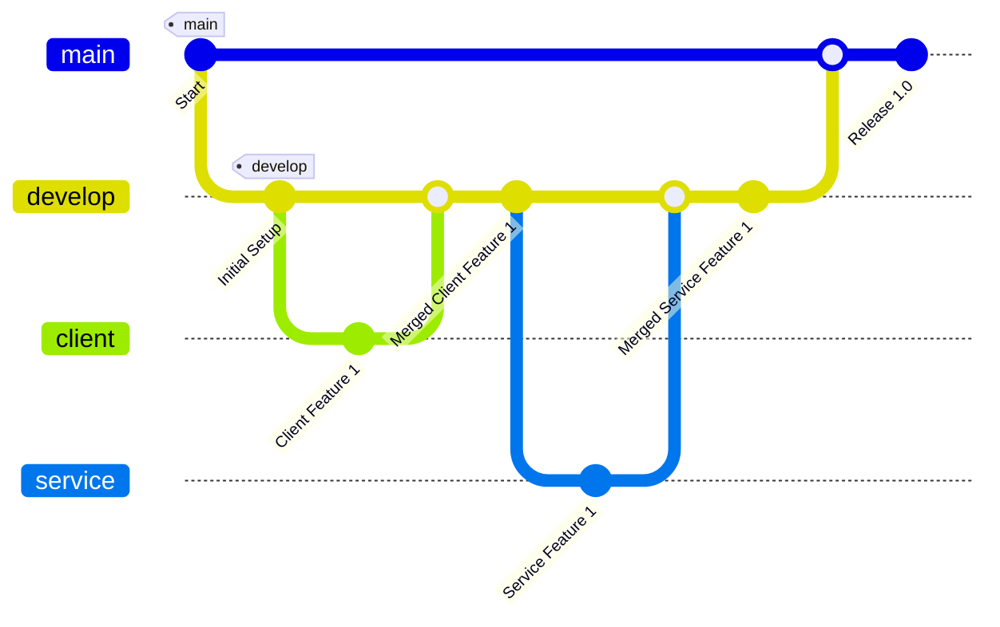

# Arquitetura do Projeto

Este documento descreve a arquitetura do projeto do aplicativo, incluindo a estrutura de pastas, o objetivo do projeto e o fluxo de trabalho Git adotado.

## Objetivo do Projeto

O objetivo deste projeto é desenvolver um aplicativo moderno e escalável que ofereça uma interface de usuário intuitiva e responsiva, além de um back-end robusto para lidar com a lógica de negócios e a gestão de dados.

## Estrutura de Pastas

O projeto do aplicativo é dividido em duas principais pastas: `client` e `service`.

- **📁 `client`**: Contém o código fonte da interface do usuário do aplicativo, desenvolvido com React (e possivelmente React Native para componentes específicos de dispositivos móveis). Esta pasta inclui todos os componentes visuais, estilos e a lógica de interação do front-end, adaptados para uma experiência móvel.
- **📁 `service`**: Contém o código fonte do back-end do aplicativo, desenvolvido em Spring Boot. Esta pasta inclui a lógica de negócios, APIs REST, e outras funcionalidades relacionadas ao servidor que suportam o aplicativo.
## Fluxo Git

O projeto do aplicativo segue um fluxo de trabalho Git estruturado para facilitar o desenvolvimento, teste e implantação contínuos. As principais branches e suas funções são descritas a seguir:

- **Branch `main`**: A branch principal que contém a versão estável do código do aplicativo. As versões de produção são derivadas desta branch.

- **Branch `develop`**: A branch de desenvolvimento que contém as funcionalidades em estágio de desenvolvimento e teste. Esta branch é usada para integração contínua e testes de qualidade.

- **Branches Filhas da Develop**:
  - **`client`**: Ramificada a partir de `develop`, esta branch é usada especificamente para desenvolvimento de funcionalidades e correções relacionadas à interface do usuário e à lógica do front-end do aplicativo.
  - **`service`**: Ramificada a partir de `develop`, esta branch é usada para desenvolvimento de funcionalidades e correções relacionadas ao back-end e à lógica de negócios do aplicativo.

### Diagrama de Fluxo Git

## Procedimentos de Desenvolvimento

1. **Novo Desenvolvimento**: Crie uma nova branch a partir de `develop` para trabalhar em uma nova funcionalidade ou correção de bug específica do aplicativo.
2. **Commits**: Faça commits regulares e descritivos para cada alteração significativa, documentando claramente o progresso e as alterações.
3. **Merge**: Após o desenvolvimento e testes na branch filha (`client` ou `service`), faça um merge de volta para `develop`.
4. **Revisão de Código**: Realize uma revisão de código antes de integrar as alterações na branch `develop` para garantir qualidade e consistência.
5. **Lançamento**: Quando estiver pronto para uma nova versão do aplicativo, faça um merge da branch `develop` para a branch `main`.

## Considerações Finais

Este documento deve ser revisado e atualizado conforme a evolução do aplicativo. Manter a documentação alinhada com a estrutura real do projeto é essencial para garantir a eficiência e a clareza no desenvolvimento do aplicativo.

### Notas:

- **Objetivo**: A documentação agora reflete que o projeto é um aplicativo, com ênfase em funcionalidades e interfaces específicas para apps.
- **Mermaid**: Continua a ser utilizado para representar a arquitetura e o fluxo Git, adaptado para o contexto de desenvolvimento de aplicativos.

Esses ajustes ajudam a manter o foco nos aspectos mais relevantes para o desenvolvimento e manutenção de um aplicativo, fornecendo clareza aos desenvolvedores que trabalham no projeto.

---
### Equipe Dev

  <table>
    <tr>
      <td align="center">
         
        <a href="https://github.com/jucaodamontanha" ><b>Lineker Xavier</b></a> 
        <i>BackEnd</i>
      </td>
      <td align="center">
         
        <a href="https://github.com/devkarine" ><b>Karine Pereira</b></a> 
        <i>FrontEnd</i>
      </td>
      <td align="center">
         
        <a href="https://github.com/NeanderFontes" ><b>Neander Fontes</b></a> 
        <i>BackEnd</i>
      </td>
    </tr>
    <tr>
      <td align="center">
         
        <a href="https://github.com/WesleyTMarques " ><b>Wesley Marques</b></a> 
        <i>FrontEnd</i>
      </td>
    </tr>
  </table>

